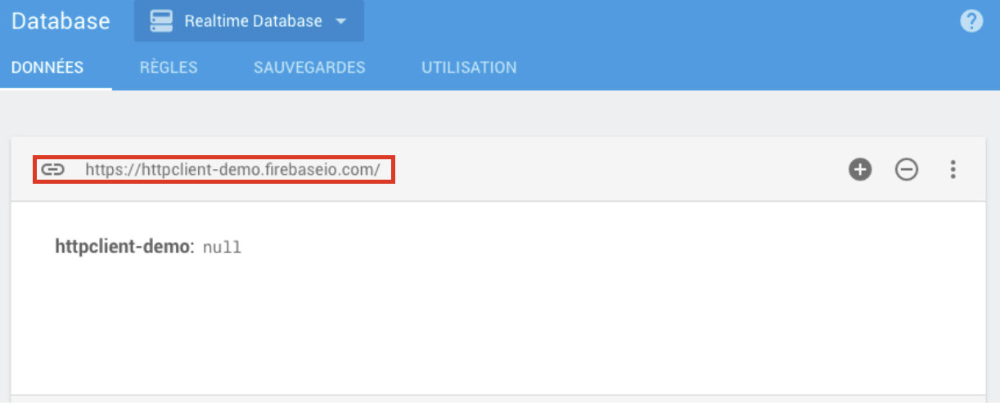

# CHAPITRE X : HTTPCLIENT ET FIREBASE

Dans ce chapitre nous allons répondre à deux problématiques :

* Comment transférer des données sur un serveur
* Comment récupérer des données stockées sur un serveur

Pour nous aider nous allons utiliser un service de Google appelé Firebase. Firebase n'est ni plus ni moins qu'un web service de Google permettant plusieurs chose dont la principale utilité à ce jour repose sur la facilitation de l'implémentation d'une base de donnée non relationnelle.

#### Pourquoi utiliser ce service ?

Il y a plusieurs raison à ça, les bases de données non relationnelles sont très performantes et fonctionnent particulièrement bien pour les applications utilisants un format type JSON. D'autre part Firebase est un service Google et Angular en est un frameworks. Les ingénieurs de Google ont donc tout intérêts à faciliter l'utilisation des deux parties aux sein d'un même projet et ainsi faciliter la vie du développeur.
Il est bien sur possible d'utiliser Angular avec une BDD relationnelle SQL ou tout autre système mais ici je vous propose d'utiliser et de survoler Firebase. De plus ce service est gratuit en dessous d'un certain volume d'échange et de stockage ce qui est très pratique dans notre cas.

## Création d'une BDD avec Firebase

Dans un premier temps pour utiliser le service Firebase vous devez disposer d'un compte Google.
Créez-en un ou identifiez-vous avec votre compte d'ors et en votre posséssion.

Connectez-vous ensuite à la console puis allez dans le menu Database. Créez une base de données en mode test, ce mode permet d'éviter l'authentification ce qui ici ne va pas nous concerner. Une fois dans votre nouvelle base de données sélectionnez `realtime database`.

L'URL de votre base de données devrait apparaître comme ceci :



Ensuite dirigez-vous dans l'onglet règles et changer les valeur du fichier JSON pour activer les clés read et write sur true. Ceci permet simplement l'écriture et la lecture des données par n'importe qui disposant du lien.

```json
{
  "rules": {
    ".read": true,
    ".write": true
  }
}
```

Ce lien va nous servir pour la suite de ce cours alors copiez-le ou revenez sur cette page par la suite. Notre base de données devrait être prête à recevoir des données et c'est ce que nous allons faire avec le module `HttpClientModule` d'Angular.


#### Avant propos

Avant de continuer la suite de ce cours je souhaite vous préciser quelques notions importantes pour bien comprendre le fonctionnement du service `HttpClient`. En effet ce service est différent du module que vous venez d'importer dans l'AppModule faites donc bien attention à distinguer les deux parties qui fonctionnent conjointement et sont dépendantes.

La deuxième chose importante à savoir est que HttpClient fonctionne en réalisant des requêtes de type Ajax et utilise les observables que vous devez connaitre pour continuer. Si ce n'est pas le cas revenez en arrère et reprennez le précédent chapitre.

HttpClient contient des méthodes permettant entre autre d'envoyer, récupérer, modifier ou encore supprimer des données. On y retrouve :

* `get()` : Qui permet de récupérer des données.
* `post()` : Qui permet d'envoyer des données.
* `put()` : Qui permet d'envoyer des données en écrasant les précédentes.
* `delete()` : Qui permet de supprimer des données.

Ces différentes méthodes créer donc des observables et prennent différents paramètres pour aboutir aux résultats escomptés.


## HttpClient

Notre base de données étant créée nous allons maintenant implémenter le module `HttpClientModule` et y insérer des données, dans un second temps nous les récupérerons.
Nous allons donc importer le module `HttpClientModule` dans l'app.module.ts qui est je vous le rappel le fichier qui nous permet de gérer les différents modules de notre application.

Dans les imports :

```typescript
import { HttpClientModule } from '@angular/common/http';
```

Dans le décorateur `@NgModule` :

```typescript
  imports: [
    BrowserModule,
    AppRoutingModule,
	FormsModule,
	HttpClientModule,
    ReactiveFormsModule
  ],
```
Une fois le module importé nous pouvons maintenant l'utiliser au sein de nos components ou de nos services et c'est justement ce que nous allons faire.

#### Envoie de données

Quelles données allons nous donc bien pouvoir envoyer sur notre BDD ? Et bien je pense que vous avez déjà la réponse, dans notre application c'est surtout l'envoie des différents devices et leurs états qui va nous intéresser. Je vous propose donc d'implémenter l'envoie de données dans notre service `DevicesService`.

Nous allons donc y importer puis y injecter le service HttpClient comme ceci :

```typescript
import { Injectable } from '@angular/core';
import { HttpClient } from '@angular/common/http';

@Injectable()
export class DevicesService {

	constructor(private HttpClient: HttpClient) {}

	//suite du code du service....
```

Puis nous allons créer une méthode permettant d'envoyer la liste des devices sur Firebase. Cette méthode ce nomera `sendDevicesState()` :

```TypeScript
	sendDevicesState() {
		const observer = {
			next: () => {
				observer.complete();
			},
			error: (error) => {
				console.error('An error has occured ' + error);
			},
			complete: () => {
				request.unsubscribe();
			},
		}

		const request = this.HttpClient
		.post('https://learning-app-2320e.firebaseio.com/devices.json', this.devices)
		.subscribe(observer);

	}
}
```
Vous remquerez que le lien de pointant vers la base de données contient le nom de notre fichier à sauvegarder ainsi que son format. Il est très important de respecter ce principe sinon vous ne pourrez pas sauvegarder votre fichier. Lorsqu'on utilise les méthodes `post` ou `put` on ajoute en second paramètre les données que nous souhaitons envoyer vers notre base de données.
Ensuite pour que notre code fonctionne nous allons modifier notre component `Devices` et ajouter un bouton appelant la méthode `sendDevicesState()` Ne vous embêtez pas avec tout ce code à réaliser voici les différents fichiers :

Pour le template HTML :

```html
<div class="card">
  <div class="card-header">
    Liste des appareils
  </div>
  <ul class="list-group list-group-flush">
      <li *ngFor="let device of devices; let i=index"
          [ngClass]="{'list-group-item-success': device.deviceStatus === 'On', 'list-group-item-danger': device.deviceStatus === 'Off'}"
          class="list-group-item">Appareil : {{ device.deviceName }}
        <span class="float-right">Status : {{ device.deviceStatus }}</span>
        <div class="mt-3">
            <button class="btn btn-success" (click)="onSwitchOn(i)">Allumer</button>
            <button class="btn btn-danger ml-1" (click)="onSwitchOff(i)">Éteindre</button>
            <button class="btn btn-light ml-1 float-right" [routerLink]="'./single-device/'+i">Voir plus</button>
        </div>
      </li>
  </ul>
</div>
<div class="row">
  <div class="col-12 text-center mt-3 mb-3 centered">
    <button class="btn btn-danger m-3" (click)="onSwitchOffAll()">Tout éteindre</button>
    <button class="btn btn-success m-3" (click)="onSwitchOnAll()">Tout allumer</button>
    <button class="btn btn-primary m-3" (click)="onSendDevicesState()">Enregistrer</button>
  </div>
</div>
```

Et pour la partie TypeScript :

```typescript
import { Component, OnInit } from '@angular/core';
import { DevicesService } from '../services/devices.service';

@Component({
  selector: 'app-devices',
  templateUrl: './devices.component.html',
  styleUrls: ['./devices.component.scss']
})
export class DevicesComponent implements OnInit {

  devices: any;

  constructor(private DevicesService: DevicesService) { 
    this.devices = this.DevicesService.devices;
  }

	onSwitchOn(i) {
		this.DevicesService.onSwitchOn(i);
	}

	onSwitchOff(i) {
		this.DevicesService.onSwitchOff(i);
	}

	onSwitchOnAll() {
		this.DevicesService.onSwitchOnAll();
	}

	onSwitchOffAll() {
		this.DevicesService.onSwitchOffAll();
	}

	onSendDevicesState() {
		this.DevicesService.sendDevicesState();
	}

  ngOnInit() {
	}
	

  ngOnDestroy(): void {
    console.log('destroy')
  }

}
```
Voilà notre component est fin prêt à envoyer des requêtes pour sauvegarder la liste de nos appareils.
Essayez ce code et rendez-vous dans Firebase pour observer le comportement de votre base de données. On peut remarquer qu'une clé aléatoire est créée à chaque fois que vous sauvegardez votre liste ce qui n'est pas le comportement souhaité. Nous allons donc remplacer la méthode `post` de l'observable créé avec `HttpClient` par la méthode `put`. Celle-ci aura pour effet de supprimer les précédentes données enregistrées si le path et le fichier sont identiques.

```typescript
		const request = this.HttpClient
		.post('https://learning-app-2320e.firebaseio.com/devices.json', this.devices)
		.subscribe(observer);
```

Vous savez maintenant gérer l'envoie de données vers Firebase. Je vous propose de voir maintenant comment récupérer ces données.

#### Récupérer des données

Pour récupérer des données la méthode est similaire à l'exception que nous utiliserons la méthode `get` de notre service `HttpClient`. Nous devons également créer un observer capable d'assigner les données reçu à la propriété devices contenant le tableaux de nos différents appareils.

Créons donc une méthode dans notre service que nous appelerons `getDevicesState()` qui se chargera de récupérer les données que nous venons de transmettre à notre BDD. Commençons par supprimer notre tableau et remplaçons le par une simple déclaration de type dans notre classe :

```typescript
	private devices: any[];
```

Passons à la création de la méthode :

```typescript
	getDevicesState():void {
		const observer = {
			next: (data) => {
				this.devices = data;
				observer.complete();
			},
			error: (error) => {
				console.error('An error has occured ' + error);
			},
			complete: () => {
				request.unsubscribe();
			}
		}

		let request = this.HttpClient
		.get('https://learning-app-2320e.firebaseio.com/devices.json')
		.subscribe(observer);
	}
```
Puis dans notre component `Devices` il nous faudra appeller cette méthode lors de l'initialisations :

```typescript
  ngOnInit() {
	  this.DevicesService.getDevicesState();
	}

```

Maintenant nous allons vérifier que notre code fonctionne en nous rendant sur notre page des appareils. Cependant mauvaise surprise, notre tableau est vide et ne s'actualise pas =(. Vérifions si cela provien de notre requête en plaçant un `console.log(data)` dans la propriété `next` de notre observer.

```typescript
			next: (data) => {
        this.devices = data;
        console.log(data);
				observer.complete();
			},
```
Apparemment la requête fonctionne bien et nous recevons bien nos données alors quel est le problème ?
Je vous explique tout ça. Lorsque nous utilisons notre constructeur du component `Devices` celui instancie une propriété privée `DevicesService`. Ensuite lorsque nous demandons à notre service de récupérer les données et de les stocker dans notre propriété `devices` celui-ci effectue bien cette tâche. Jusqu'ici tout va bien. Cependant lors de l'initialisation de notre component `Devices` nous demandons à la propriété `devices` de contenir le tableau également appelé `devices` du service et de façon instantanné avant même que celui-ci n'est pu recevoir quelconque données. Alors comment faire ? C'est ce que je vous propose de voir maintenant.


#### Rester à jour avec Subject

Comme le titre vous l'a surement fait deviner nous allons utiliser un observable qui nous retournera à chaque itération de l'observer notre tableau `devices`. Nous allons donc implémenter cette fonctionnalité dans notre service dans un premier temps. Pour cela il existe un observable disponible dans RxJS appelé `Subject` et c'est celui-ci dont nous allons nous servir.

Importons justement cet observable depuis la librairie RxJS puis créons une propriété qui contiendra un objet instancié depuis ça classe :

```typescript
import { Injectable } from '@angular/core';
import { HttpClient } from '@angular/common/http';
import { Subject } from 'rxjs';

@Injectable()
export class DevicesService {

	constructor(private HttpClient: HttpClient) {}

	private devices: any[];
	devicesSubject = new Subject<any[]>();
```

On précise que cet objet retourne un tableau.
Maintenant que nous avons notre nouvel objet nous allons créer une méthode `emitdevicesSubject()` qui nous devrons appeler à chaque changement effectué sur notre tableau `devices`. C'est à dire dans la quasi totalité des méthodes de notre classe et lors de la requête de reception des données.

```typescript
import { Injectable } from '@angular/core';
import { HttpClient } from '@angular/common/http';
import { Subject } from 'rxjs';

@Injectable()
export class DevicesService {

	constructor(private HttpClient: HttpClient) {}

	private devices: any[];
	devicesSubject = new Subject<any[]>();

	emitDevicesSubject() {
		if (typeof this.devices != 'undefined') {
			this.devicesSubject.next(this.devices.slice());
		}
	}

	getDeviceById(id: number): object {
		const device = this.devices.find(
			(device: any) => {
				return device.id == id;
			}
		)
		return device;
	}

	onSwitchOn(deviceIndex: number) {
		this.devices[deviceIndex].deviceStatus = 'On';
		this.emitDevicesSubject();
	}

	onSwitchOff(deviceIndex: number) {
		this.devices[deviceIndex].deviceStatus = 'Off'; 
		this.emitDevicesSubject();
	}

	onSwitchOnAll() {
		this.devices.forEach(element => {
			element.deviceStatus = 'On';
		});
		this.emitDevicesSubject();
	}

	onSwitchOffAll() {
		this.devices.forEach(element => {
			element.deviceStatus = 'Off';
		});
		this.emitDevicesSubject();
	}

	addNewDevice(device: any) {
		let newDevice = {
			id: this.devices.length,
			deviceName: device.name,
			deviceStatus: device.status
		};
		this.devices.push(newDevice);
		this.emitDevicesSubject();
	}

	sendDevicesState():void {
		const observer = {
			next: () => {
				observer.complete();
				this.emitDevicesSubject();
			},
			error: (error) => {
				console.error('An error has occured ' + error);
			},
			complete: () => {
				request.unsubscribe();
			}
		}

		const request = this.HttpClient
		.put('https://learning-app-2320e.firebaseio.com/devices.json', this.devices)
		.subscribe(observer);
	}

	getDevicesState():void {
		const observer = {
			next: (data) => {
				this.devices = data;
				this.emitDevicesSubject();
				observer.complete();
			},
			error: (error) => {
				console.error('An error has occured ' + error);
			},
			complete: () => {
				request.unsubscribe();
			}
		}

		let request = this.HttpClient
		.get('https://learning-app-2320e.firebaseio.com/devices.json')
		.subscribe(observer);
	}

}
```

Maintenant à chaque appel d'une méthode concernée par le tableau celle-ci emetera par le biais de la méthode `emitDevicesSubject()` une copie de la nouvelle version de notre tableau `devices`. Nous créons par ailleurs une copie grâce à la méthode `slice()`. Ce n'est pas tout, comme vous pouvez le constater nous n'avons pas encore souscrit à l'observable `devicesSubject` et c'est ce que nous allons faire dans notre component `Devices`.
Première chose il nous faut importer `Souscription` depuis RxJS comme vous le savez déjà puis créer une propriété que je vous propose de nommer `devicesSouscription`.


Puis lors de l'initialisation de notre component nous allons appeller la méthode `getDevicesState()` du service `DevicesService` pour récupérer les données. Dans un second temps nous souscrirons à l'observable `devicesSubject` grâce à notre propriété `devicesSubscription` qui se chargera de mettre à jour les données à chaque changements.

```typescript
  ngOnInit() {
	  this.DevicesService.getDevicesState();
		this.devicesSubscription = this.DevicesService.devicesSubject.subscribe(
			(devices) => {
				this.devices = devices;
			}
		);
	}
```

Voyons maintenant si nous service fonctionne. It's works !!!
Les `Subject` sont des observables réellement indispensables au bont fonctionnement d'une application et notamment lors de la communication entre un service et un component.

#### Ajouter un header à notre requête

De nombreux services, notamment beaucoup d'API, demandent de compléter le header d'une requête avec des informations particulières. On retrouve souvent le format de fichier qui dans le cas d'un JSON peut être indiqué comme ceci : `content-type: application/json`. Je vous propose d'ajouter cette petite précision à notre méthode `sendDevicesState` dans notre service `DevicesService`.

Pour ce faire nous allons devoir importer le module `HttpHeaders` depuis les modules d'Agular. Dans notre service :

```typescript
import { HttpClient, HttpHeaders } from '@angular/common/http';
```

Il nous faudra par la suite créer un nouvel objet depuis ce module, étant donné que celui-ci pourrait nous servir dans plusieurs requêtes par la suite je vous propose de créer cette objet directement dans les propriétés de notre classe du service. Ce nouvel objet prend en paramètre un second objet qui contiendra une propriété appelée `headers` qui elle même contiendra un objet faisant référence aux différentes instructions devant figurer dans notre requête. Pour être plus cair voici ce que cela donne avec ce que nous avons décidé d'implémenter :

```typescript
	httpSendOptions = {
		headers: new HttpHeaders({
			'Content-Type': 'application/json'
		})
	}
```

Maintenant que nous avons défini ce que nous souhaitions dans notre header et plus précisement dans la propriété `httpSendOptions` de notre classe de service, nous allons l'implémenter à la méthode `sendDevicesState`. Pour cela rien de bien complexe il nous suffit de l'indiquer en troisième paramètre de notre méthode `put` ce qui donne ceci :

```typescript
	sendDevicesState():void {
		const observer = {
			next: () => {
				observer.complete();
				this.emitDevicesSubject();
			},
			error: (error) => {
				console.error('An error has occured ' + error);
			},
			complete: () => {
				request.unsubscribe();
			}
		}

		const request = this.HttpClient
		.put('https://learning-app-2320e.firebaseio.com/devices.json', this.devices, this.httpSendOptions)
		.subscribe(observer);
	}
```

Si vous testez votre application vous pourrez constater que rien ne change, c'est normal car firebase n'a pas besoin de cette précision lorsque le fichier se termine par `.json`. Quoi qu'il en soit vous savez maintenant comment ajouter une ou plusieurs informations dans le header de votre requête.

## Conclusion

Vous savez maintenant échanger des données entre un serveur et votre client. Ce qui est un grand pas en avant. Bien sûr l'application n'est absolument pas obtimisée, on pourrait imaginer une application qui se mettrait à jour automatiquement à chaque changement d'état. D'ailleurs le component `AddDevice` n'est plus fonctionnel et pour vous exercer je vous propose de l'adapter à ce que vous venez d'implémenter. Avec ce que vous avez appris cela de devrait pas être trop complexe. Dans le prochain chapitre nous verrons comment gérer les erreurs lors de vos requêtes HTTP avec `HttpClient` =).